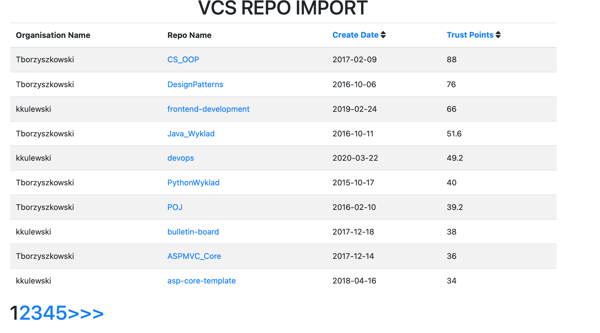

# VCS IMPORT PROJECT
Application gets data from Github API and imports to it's own database, then displays the imported data.

## How to run

1. Github API without token inserted can only obtain 60 requests per hour, in this app it's solved with Rate Limitter, which stops the program after 60 requests are used, and wait towards it's available again. With the token you can use 5000 requests per hour. You have to set parameter `'GITHUB_TOKEN'` in `.env file`. You can obtain it from your `GitHub Account -> Settings -> Developer Settings -> Personal access tokens -> Generate New Token`. 

2. Run command 
`composer install`

3. Build docker
`docker-compose up -d`

4. Enter into docker container bash
`docker-compose exec application bash`

5. Make migrations
`php bin/console doctrine:migrations:migrate`

6. Import repository via command

`php bin/console import:repository <name> <provider>`

6. Now check the website

`http://localhost:8888/<provider_name>`

7. If you want to add new provider, you have to create new Entity that will extend Abstract Class of Org. Then you have to create Service of that Provider in MessageHandler. Then it's important to add a call in services.yaml file example:

`App\Message\ImportCommandCreator:`
        `calls:`
        `.....`
        `.....`
            `- ['registerFactory', ['name',` 
            `'@App\Message\nameImportCommandFactory']]`
`

# API

`http://localhost:8888/api`

# App Preview

Author
* **Wiktor Korol** - [wkorol](https://github.com/wkorol)

